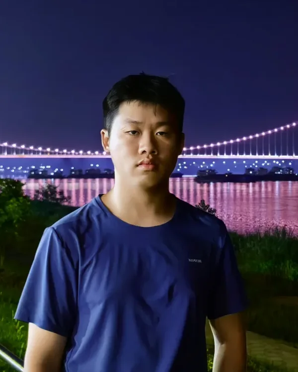
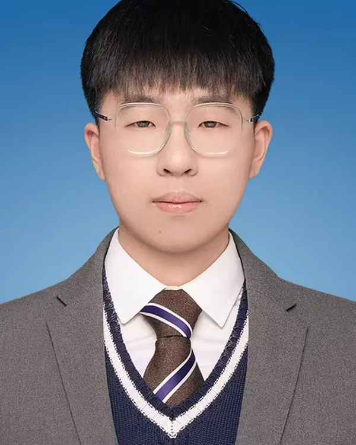
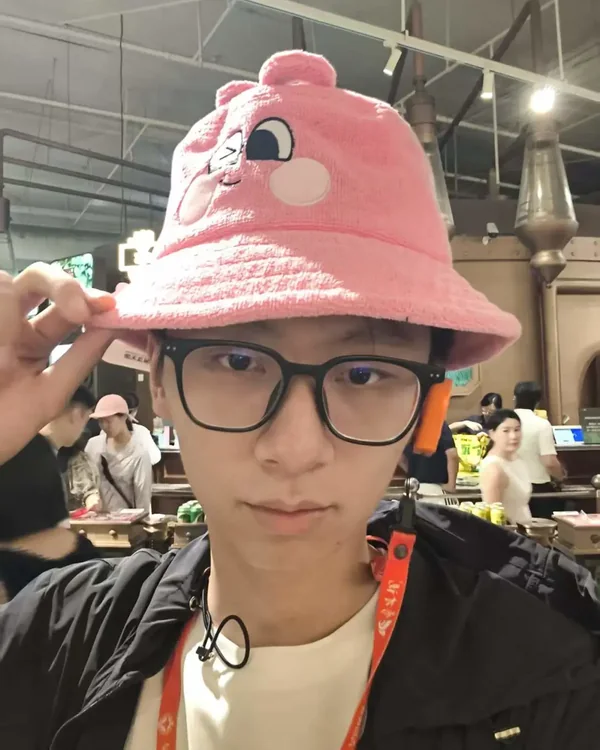
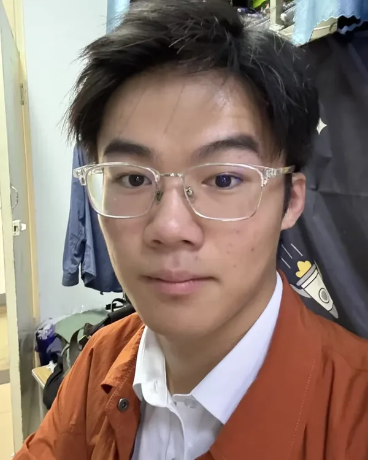
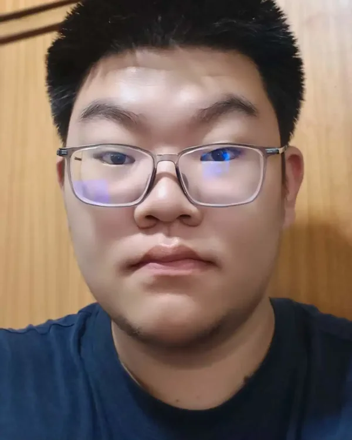
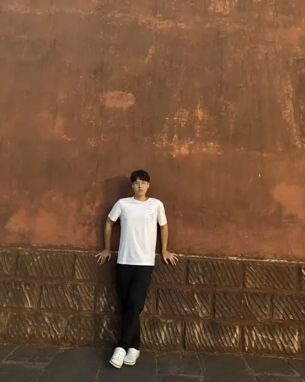
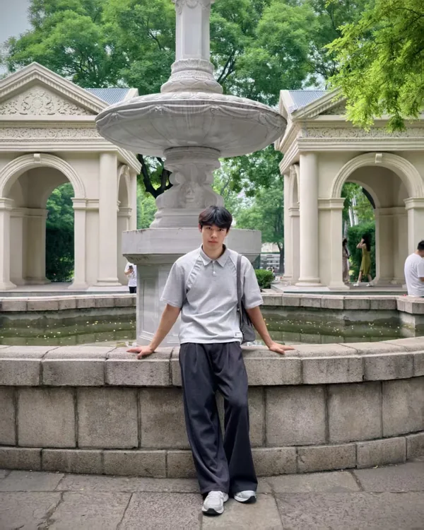
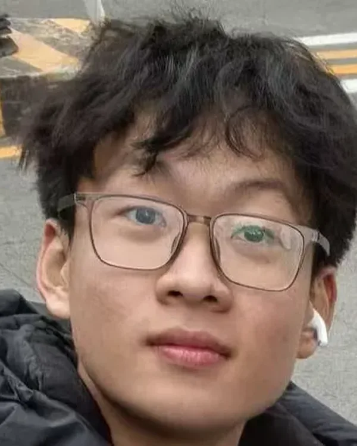
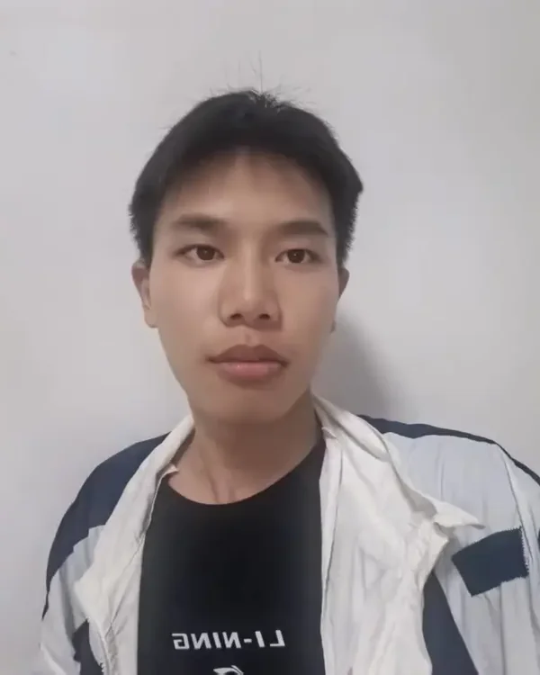

# 02 团队与分工

## 指导团队

| 角色 | 说明 |
|------|------|
| 指导教师（1 名，随团） | 地球科学与资源学院辅导员；安全第一责任人；审定访谈提纲、问卷终稿、报告框架与双片成片 |
| 思政实践课教师（1 名） | 结合实践主题组织理论学习，不随团 |
| 对接单位 | 贾汪区有关单位（信息内部保留） |

## 学生成员（12 名）

全部来自地球科学与资源学院，已完成《地球科学概论》与北戴河野外地质实习。以下简介为队员本人撰写。

### 统筹

**夏煜棠 · 团长**（湖北宜昌）

> 实践期间主要负责协调全局事务，厘清任务脉络、锚定工作方向，做好团队步调的统筹衔接。期待和各位伙伴同心同行，扎实完成各项调研任务。

**顾梣懿 · 后勤信息保障**（江苏扬州）

> 负责后勤保障、资料整理与机动补位，兼任团队安全员。平时喜爱羽毛球，性格开朗、善于沟通，期待和各位伙伴多交流、互学共进。

### 入户访谈组

围绕塌陷区居民生活变迁开展入户访谈，同时配合问卷发放；每组目标完成 10 户，访谈严格执行知情同意。

**A 组（大吴街道）：组长黄子豪，组员覃汉杰**

 

> **黄子豪**：学习成绩优异，对待工作踏实认真，善于沟通协作，平时喜欢跑步和滑雪。希望借本次暑期实践走出课堂、深入现实，以青年视角观察思考。
>
> **覃汉杰**：期待和大家一起走进徐州，在行走中观察，在记录中思考，共同留下一段有意义的夏日记忆。

**B 组（潘安湖周边）：组长孟杨，组员崔文阳**

 

> **孟杨**：平时喜欢听歌、跑步，希望通过这次实践与大家一起提升自我、共同进步。
>
> **崔文阳**：2025 级地质学本科生，来自河南安阳。期待和大家一同走进徐州矿区，实地开展矿层地质调查。

### 深度访谈组

对矿工、村干部、修复建设者等关键人物开展深度访谈，建立人物档案，采集口述史素材。

**组长邱家宝（兼团队宣传）**（陕西西安）

> 负责新闻稿撰写投稿与媒体对接。以文字理清事务脉络，习惯透过现象梳理内在逻辑，始终保持对新事物的探索。

**组员杨添棋（兼纪录片脚本与分镜设计）**

> 平时爱好看动漫以及打篮球。希望多与团内同学增进交流，在实践中共同成长。

### 问卷资料组

负责问卷调查的设计、发放、统计分析与资料汇编。

**组长王玺迪**（陕西西安）

> 统筹问卷设计、发放组织、统计分析与资料汇编。平时喜欢音乐与文学作品，也喜欢健身。

**组员赵博睿**（黑龙江）

> 负责数据录入与归档管理。工作态度认真，热爱体育锻炼，乐于团队沟通合作。

### 影像记录组

负责长纪录片与短宣传片"双片"的影像采集与制作。

**组长郭航**（重庆）

> 负责双片拍摄统筹、航拍与粗剪。希望在行程中和大家多沟通、多交流，互相学习，一起有所收获。

**组员孙天佑**（安徽灵璧）

> 负责照片记录、设备管理与素材备份。希望在实践中深入社会，在观察与思考中开阔眼界、提升能力。

## 相关页面

[项目总览](01_项目总览.md) · [预期成果](11_预期成果清单.md)
