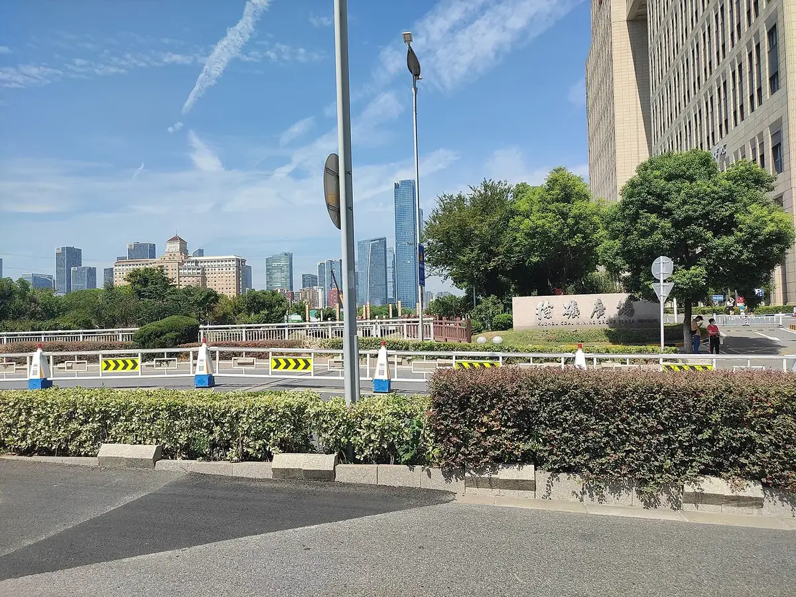

# 04 区域背景：徐州与贾汪

## 徐州采煤史脉络

*图：徐矿广场与徐州主城天际线（Wikimedia Commons 公开图片）*

- **北宋**：苏轼查勘煤炭并作《石炭》诗，为徐州采煤最早的文献记忆。
- **1882 年 10 月 5 日**：胡恩燮奉准设局兴办"徐州煤铁矿"（利国矿务总局），徐州近代煤矿开采正式开始，属中国近代最早的民族工业之一；该日被定为徐州煤矿开采纪念日。此后矿址东迁青山泉、贾汪，"贾家汪"渐称"贾汪"；民国时期矿权"七易窑主"，1948 年 11 月"贾汪起义"后煤矿回到人民手中。
- **新中国时期**：1953 年成立贾汪矿务局；1958 年成立徐州煤炭矿务局（次年改称徐州矿务局）；1998 年改制为徐矿集团。1979 年全局产煤 1285 万吨创历史最高纪录；1985 年徐州市境内年产量近 2000 万吨、占江苏全省约 95%，历有"江苏煤都"之称。
- **贾汪鼎盛期**：大小矿井两百余对，高峰年产煤约 1400 万吨；煤炭产业一度占全区财政收入 80% 以上、从业人员超 16 万人；"因矿成区、因煤而兴、因矿设区"，徐矿集团曾有"十万矿工和二十万矿工家属"。

## 衰竭与关停

- **2001.7.22**：贾汪区岗子村特大瓦斯爆炸事故致 92 人遇难，成为大规模关停小煤矿的转折点。
- 2001 年 11 月大黄山、董庄、夏桥井启动破产关闭；2008 年韩桥、青山泉等六对矿井关闭破产；2010 年权台煤矿关闭（另有 2011、2013 年之说，口径待核）。
- **2011 年 11 月**：贾汪区列入全国第三批资源枯竭城市名单，为江苏省首个国家级资源枯竭地区，国家每年给予财力转移支付约 2 亿元。
- **2016 年 10 月**：贾汪境内最后一座煤矿旗山煤矿关闭，贾汪正式进入"无煤时代"（另有矿工回忆称 2016 年 1 月 13 日开始关井，可在口述史访谈中追问核实）。

## 采煤塌陷的规模

| 指标 | 数据 | 备注 |
|------|------|------|
| 全市塌陷区总面积 | 282.26 km²（约 42.33 万亩） | 涉及贾汪、九里、闸河、利国四大煤田；分布于贾汪、铜山、泉山、鼓楼、沛县、丰县（汤志刚等 2020） |
| 城市规划区采空区面积 | 约 140 km² | 14 个关闭煤矿采空区估算储水 7583 万 m³，可建 7 个采空区地下水库（姜素等 2018） |
| 地质灾害隐患点 | 50 余处 | 汤志刚等 2020 |
| 贾汪区采煤塌陷地 | 13.23 万亩 | 超全市塌陷地 1/3；另有"约占贾汪区总面积 12%"口径（分母不同） |
| 贾汪区塌陷地（公顷口径） | 8860 公顷 | 平均塌陷深度 4 米，常年积水耕地 240 公顷 |
| 徐州采煤塌陷地（周文琴口径） | 约 23000 hm²（230 km²） | 周文琴、王宝玉《江苏建设》——与 282.26 km² 口径并存，注意统计范围差异 |

## 大吴街道（重点调研区）

- 2013 年 8 月撤镇设大吴街道（项目文件沿用"大吴镇"称谓）；境内有旗山煤矿，与权台煤矿塌陷区相连。
- 未修复原始塌陷地貌保存较完整、矿工社区遗存较集中；多个社区名称源于矿区与矿工新村。
- 2023 年以来媒体记录存在空白，团队一线入户调查有望形成一手增量。
- 可观察对象：塌陷坑、地裂缝、积水湿地等地质遗迹 + 入户访谈与深度访谈。

## 对比区：潘安湖

潘安湖国家湿地公园为生态修复示范区，详见 [潘安湖生态修复案例](05_潘安湖生态修复案例.md)。

## 转型模式（2026-08-14 文献补充）

- **"徐州贾汪区模式"三路径**（安适等，《中国矿业》2021, 30(6): 44–49）：放大正向外部效应、长期坚持矿地融合、大力建设矿区社会生态系统恢复力；东部矿区"人口密集、农业发达、沉陷积水"是共性特征，转型模式值得互鉴。
- **修复关键区识别**（《基于生态安全格局的资源枯竭型城市生态保护修复关键区识别：以徐州市贾汪区为例》，《中国矿业》2024）：定量评估 2000–2020 年贾汪生态系统服务变化，为"哪里该优先修复"提供空间证据。
- **民生参照系**（管晶等，《经济地理》2022, 42(1): 168–175）：淮北 5 个安置社区 700 份问卷（有效 622 份、有效率 92.15%）、21 题项 5 点李克特、6 维度因子分析；总体居住满意度均值仅 3.13，**经济收入（补偿标准均值 2.45）与社区参与满意度最低**，自建类独院社区满意度高于统建多层公寓——本项目问卷设计与"搬迁满意度"假设的直接参照。

## 相关页面

[潘安湖生态修复案例](05_潘安湖生态修复案例.md) · [地质知识_采煤塌陷机理](06_地质知识_采煤塌陷机理.md) · 数据口径核查（内部资料）
