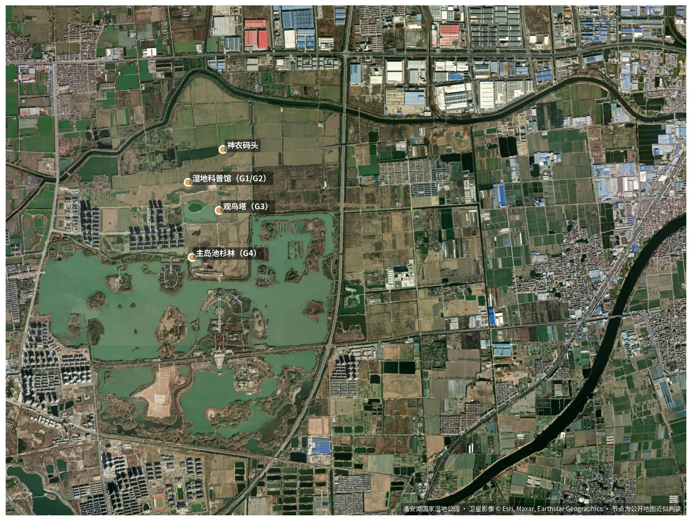

# 14 地质遗迹考察路线（潘安湖 G1–G10）

> 提炼自《潘安湖地质遗迹考察路线设计报告》（`03_文献与背景资料/综述与报告/`），实践期间考察候选路线时对照使用。

## 设计理念

- **叙事主线**："创伤—修复—重生"——从塌陷成因到修复工程再到生态重生；
- **原则**：科学性（术语附通俗解释、数据可考）、安全性（全程在开放景区、避未稳沉区）、趣味性（对比观察、触摸体验）、可达性（步行 + 游船 + 观光车组合）；
- **闭环学习**："馆内预习—野外考察—馆内总结"。

## 节点总览

*图：湖区卫星影像上的 G1–G4 与神农码头近似位置（影像 © Esri, Maxar；以现场为准）*

| 节点 | 名称 | 地质主题 | 时长 | 路线 |
|------|------|----------|------|------|
| G1 | 科普馆·序厅 | 塌陷成因与治理总览（"上三带"模型） | 30 min | 半日/一日 |
| G2 | 科普馆·蝶变展厅 | 四位一体治理、挖深垫浅剖面 | 20 min | 半日/一日 |
| G3 | 观鸟塔·顶层 | 沉陷盆地宏观地貌、岛屿格局 | 15 min | 半日/一日 |
| G4 | 主岛·池杉林栈道 | 湿地植被与土壤修复、膝根观察 | 25 min | 半日/一日 |
| G5 | 湖心航线·画舫 | 水深变化反映塌陷不均匀性 | 20 min | 半日/一日 |
| G6 | 潘安古村岛 | 聚落迁移与塌陷搬迁对比 | 20 min | 一日 |
| G7 | 煤矿文化博物馆 | 工业遗产：绞车、支护构件 | 25 min | 一日 |
| G8 | 湖岸带地裂缝点 | 裂缝走向、愈合痕迹 | 20 min | 一日 |
| G9 | 池杉林生态监测点 | 鸟类/鱼类/水生植物评估 | 20 min | 一日 |
| G10 | 科普馆总结互动区 | 全息体感、微缩湿地 DIY、问答 | 25 min | 一日 |

## 两套方案

- **半日精华路线**（3 小时，约 3 km）：G1→G2→G3→G4→G5，步行 + 画舫；适合一般游客。
- **一日深度路线**（6 小时，约 8 km）：G1–G10 全节点，上午 9:00–11:30、午餐 11:30–13:00、下午 13:00–16:30；适合大学生研学团队，建议配讲解员 1 名 + 安全员 1 名。

## 关键解说知识点

- **G1**："上三带"（冒落带/裂隙带/弯曲带）决定塌陷程度；潘安湖平均塌陷 4 m、最深超 8 m，总面积约 11.6 km²、涉及 6 村约 3000 户。
- **G3**：湖岸线呈受采煤工作面控制的不规则几何形态；19 座岛屿为人工"新地质体"；从地貌反推断层与采空区位置。
- **G4**：池杉"膝根"为呼吸根；植被恢复是土壤水文改善的生物指标；"水下森林"30 余种鱼类反映水质。
- **G5**：水色蓝绿 = 深水（塌陷中心）、黄褐 = 浅水；岛屿人工陡岸特征；湖水与运河连通的水文地质系统。
- **G8**：裂缝走向与采煤工作面平行/垂直，可反推采空区范围；"大地是有记忆的"。

## 现有景区 8 站路线评估

仅第 2 站（湿地保育区）与第 5 站（煤矿文化博物馆）涉及地质主题；存在地质叙事不连贯、实地观察点缺失、专业深度不够、互动不足四个改进空间——这正是团队路线方案的增量价值。

## 装备建议（考察团）

防滑鞋、饮用水、防晒、地质记录本 + 铅笔、10 倍放大镜、3 米卷尺、地质罗盘（或手机 APP）；地质锤景区内须许可。

## 推广要点（供报告建议章节参考）

- 产品定位：现有生态路线的"专业版"，半日 80–120 元/人、一日 180–250 元/人（建议价）；
- 三级标识体系（导览牌/节点解说牌/细节提示牌）+ AR 数字导览；
- 研学课程化：小学"湿地探险家"、中学"塌陷区变形计"、大学"生态修复工程评估"。

## 相关页面

[地质知识_采煤塌陷机理](06_地质知识_采煤塌陷机理.md) · [潘安湖生态修复案例](05_潘安湖生态修复案例.md) · 安全与应急预案（内部资料）
