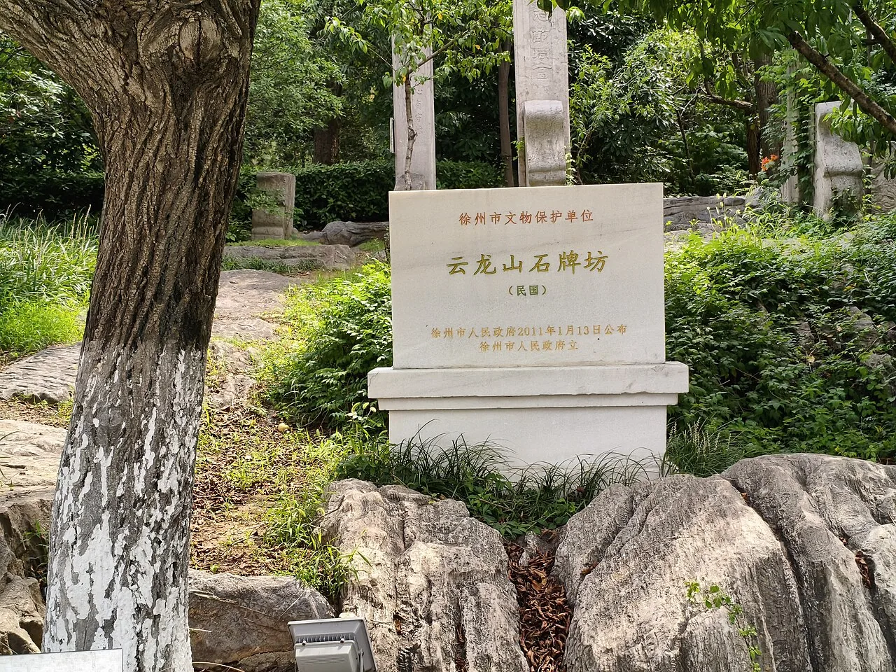

# 23 目标地百科：徐州与贾汪

> 本页汇集调研目的地的公开百科与史志资料，帮助读者快速建立对这片土地的整体认知。资料来源：公开区划地名资料、地方史志与《徐州煤矿史》等公开出版物。

## 徐州：五省通衢与千年煤城

*图：云龙山石牌坊（民国），徐州市文物保护单位（Wikimedia Commons 公开图片）*

- **城市地位**：徐州古称彭城，为古九州之一，地处苏鲁豫皖四省交界，历来是"五省通衢"的交通枢纽与兵家必争之地；今天的徐州是淮海经济区中心城市、中国矿业大学所在地。
- **采煤的文献起点**：北宋元丰元年（1078 年）十二月，知州苏轼为解决城中"湿薪半束抱衾稠，日暮敲门无处换"的燃料之困，派人在州西南白土镇访获石炭（煤），并写下《石炭·并引》——**中国文学史上第一首咏煤炭的诗，也是彭城采煤最早的文献记载**。诗中"岂料山中有遗宝，磊落如盘万车炭"至今仍是徐州煤炭文化的名片。
- **近代煤矿开端**：清光绪八年（1882 年）10 月 5 日，胡恩燮奉准设局兴办"徐州煤铁矿"（利国矿务总局），属中国近代最早的民族工业之一。该日后来被定为徐州煤矿开采纪念日。
- **沉重的一页**：抗战期间贾汪煤矿沦陷为"柳泉炭矿"，1938–1945 年间被掠夺煤炭约 245.9 万吨，煤田遭毁灭性破坏；1948 年 11 月"贾汪起义"后煤矿回到人民手中。
- **产业峰值**：1985 年徐州市境内产煤近 2000 万吨、约占江苏全省 95%，素称"江苏煤都"。

## 贾汪区：因矿成区的百年煤城

- **地名由来**：明万历年间有人迁居今城区一带，临"汪"（洼地水塘）而居，因贾姓人多，称"贾家汪"；又因东北有泉汇而成汪，别称"泉城"。光绪二十四年（1898 年）贾汪煤矿公司成立后，"贾家汪"渐称"贾汪"。1965 年正式定名徐州市贾汪区。
- **建置沿革**：清咸丰九年（1859 年）已成集市 → 1882 年掘井建矿 → 1928 年建镇 → 1948 年 11 月解放 → 1952 年成立贾汪矿区 → 1965 年定名贾汪区。
- **区情**：位于徐州主城区东北约 35 km，总面积约 690 km²；曾拥有全国综合实力"千强镇"大吴镇、青山泉镇；现有潘安湖、大洞山、督公湖、凤鸣海等景区，被称为"徐州后花园"。
- **煤炭兴衰的数字**：鼎盛期大小矿井 226–251 对（口径不同），从业人员超 16 万，煤炭产业占全区财政收入 80% 以上；1996 年煤矿 251 座 → 2007 年仅剩 11 座 → 2016 年 10 月旗山煤矿关闭，贾汪进入"无煤时代"。
- **转型成效**：2002–2018 年，贾汪 GDP 从 34.30 亿元增至 330.60 亿元（9.64 倍），财政收入从 1.55 亿元增至 22.57 亿元；2011 年列入全国第三批资源枯竭城市（江苏首个），2017–2024 连续七次获全国资源枯竭城市转型绩效评价"优秀"。

## 大吴街道与潘安湖街道

- **大吴街道**：位于贾汪区南部、不牢河畔，境内有旗山煤矿遗址，与权台煤矿塌陷区相连；未修复原始塌陷地貌保存较完整，是本项目"创伤"样本区。2013 年撤镇设街道。地名档案显示，旗山煤矿开采塌陷曾致东大吴村整体搬迁——塌陷对聚落的影响早已写进村名沿革。
- **潘安湖街道**：潘安湖国家湿地公园所在地，涵盖潘安、权台、马庄等村庄；马庄村以香包非遗产业闻名（2023 年销售超 1000 万元、带动 3000 余人就近就业），2017 年 12 月习近平总书记曾赴马庄村考察。

## 我们的分析

1. **地名即档案**：从"贾家汪"到"贾汪"、从"大吴大队"到"东大吴搬迁"，地名变迁本身就是一部微缩的矿业聚落史——这正是"地质记忆"概念在地名学上的证据。
2. **三次能源—生态角色反转**：苏轼时代"找煤救薪荒"（生态压力逼出能源利用）→ 20 世纪"采煤保供给"（能源开发制造生态创伤）→ 21 世纪"修复还绿"（生态修复反哺发展）。贾汪的 130 年是中国资源型地区命运的一个缩影。
3. **转型的可对照性**：贾汪 2016 年才彻底关矿，转型仅十余年便七获"优秀"，说明"创伤—修复—重生"的链条在时间上离我们极近——井下的人、搬迁的户、转业的船娘都还在世，**口述史采集正当其时**。

## 相关页面

[潘安湖修复案例](05_潘安湖生态修复案例.md) · [前人研究综述](22_前人研究综述.md) · [公开报道人物志](24_公开人物志.md)
